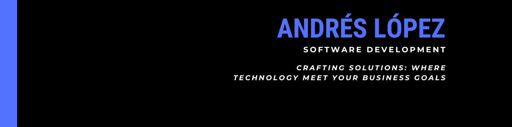

# Welcome 

  

## About me

Highly motivated and adaptable software developer with 1 year of hands-on experience in designing and maintaining mobile and web applications. Proficient in utilizing atomic design methodology and test-driven development for streamlined development and optimal performance. Pursuing a diploma in Web Development and a Bachelor in Data Science to further expand skills and knowledge in the field. Committed to building visually appealing websites and highly performant applications that meet client needs while enhancing the user experience. Demonstrated problem-solving skills and a desire to work collaboratively to achieve team success.

- 🌍  I'm based in Vancouver, Canada
- 🖥️  See my portfolio at [www.andrestechsolutions.com](http://www.andrestechsolutions.com)
- ✉️  You can contact me at [lopez.andresrigoberto@gmail.com](mailto:lopez.andresrigoberto@gmail.com)
- 🚀  I'm currently working on [eEpic Events](http://www.eepic.ca)
- 🧠  I'm learning Django, Net Core, AWS and more
- 🤝  I'm open to collaborating on Full stack web and data science projects

### 🛠 Skills

**Languages:** &nbsp; 
&nbsp;
&nbsp;
&nbsp;
&nbsp;

**Frontend:** &nbsp;
&nbsp;
&nbsp;
&nbsp;
 &nbsp;
&nbsp;
&nbsp;

**Backend:** &nbsp;
&nbsp;
&nbsp;
&nbsp;
&nbsp;

**Cloud:** &nbsp;
&nbsp;

**Devops:** &nbsp;
&nbsp;
<!-- &nbsp; -->

**Database managment:** &nbsp;
&nbsp;
&nbsp;

**Q&A and Testing:** &nbsp;
&nbsp;
&nbsp;

**Workflow:** &nbsp;
&nbsp;

**Systems:**&nbsp;

&nbsp;

**Others:**&nbsp;
&nbsp;
 

<!-- &nbsp; -->
<!--  -->

### &nbsp;Connect with Me

